# ZIST Hands on Lab Guide #1 


## 1. Overview

​	이번 핸즈온은 Public Cloud 중 Azure 에서 가상 네트워크(VNET)를 생성하고 가상 머신(VM)을 생성하여, 그 위에 Nginx와 Django를 설치합니다. 그 다음 핸즈온(#2)에서 Github Action을 이용하여 CI/CD pipeline을 구현하여 소스 코드 배포를 자동화 합니다.

## 2. Prerequisite

- Azure 환경
- Git repository
- Terminal
- Python3
- pip3
- VSCode

## 3. Hands on Lab

### 1) 로컬 가상  환경 설정

``` bash
# myvenv 라는 Python 가상환경 생성
python3 -m venv myvenv

# 가상환경 활성화
cd myvenv
source ./bin/activate

(myvnenv) $ 
```

### 2) Django 설정

``` bash
# Django 설치
pip3 install django

# 배포할 프로젝트 생성
django-admin strarproject mysite

# 프로젝트에 앱(main)생성
cd mysite
python3 manage.py startapp main
```

mysite/settings.py에서 main 앱을 추가하고 사용하는 언어와 timezone 수정

``` py
...
INSTALLED_APPS = [
    'main',
    'django.contrib.admin',
    'django.contrib.auth',
    'django.contrib.contenttypes',
    'django.contrib.sessions',
    'django.contrib.messages',
    'django.contrib.staticfiles',
]
...
LANGUAGE_CODE = 'ko-kr'

TIME_ZONE = 'Asia/Seoul'
```


main폴더안에 templates 폴더를 만들고 그 안에 main 폴더를 만든 뒤 index.html 파일을 생성해 준다.

``` bash
cd ../
cd main
mkdir templates
cd templates
vi index.html
```

-main
 ㄴtemplates
	ㄴmain
		ㄴindex.html


index.html

``` html
<DOCTYPE html>
<html lang="en">
    </html>
	<head>
    	<meta charset="UTF-8">
    	<meta name="viewport" content="width=device=width, initial-scale=1.0">
    	<title>Document</title>
    </head>
    <body>
        <h1>
            Django deploy!!!
        </h1>
    </body>
</DOCTYPE>html>
```


main/views.py 설정

``` python
from django.shortcuts import render

# Create your views here
def index(request):
	return render(request, "main/index.html")
```


mysite/urls.py 설정

``` python
from django.contrib import admin
from django.urls import path
from main import views as main_views

urlpatterns = [
    path('', main_views.index, name="index"),
    path('admin/',admin.site.urls)
]
```


기본 모델을 migrate 해준 뒤 runserver로 실행

```bash
python3 manage.py makemigrations && python3 manage.py migrate
python3 manage.py runserver
```


웹 브라우저 주소창에 `http://127.0.0.1:8000/`로 접속하면 아래와 같은 화면 노출

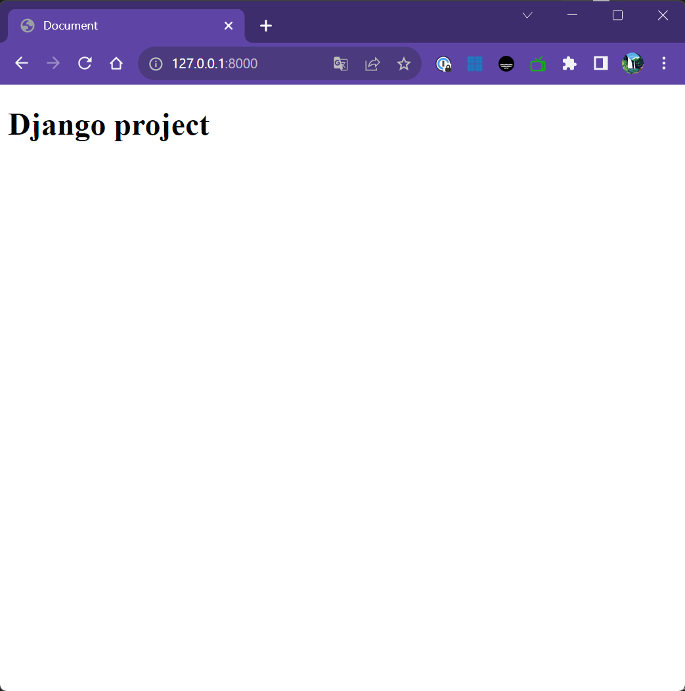


프로젝트에 사용한 패키지들을 배포 서버에도 똑같이 설치할 수 있도록 requirements.txt 를 만든다.

``` bash
# manage.py 가 있는 경로에서
$ pip3 freeze >> requirements.txt

# requirements.txt 확인(읽기)
$ cat requirements.txt
```

### 3) Azure 환경 설정

#### 3-1 Resource Group 생성

Resource group 서비스로 이동해서 생성 버튼 클릭 
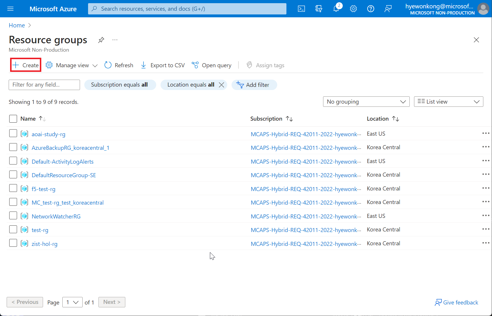


리소스 그룹 이름 지정 후 Region을 Korea Central로 선택한 다음 [Review+Create]

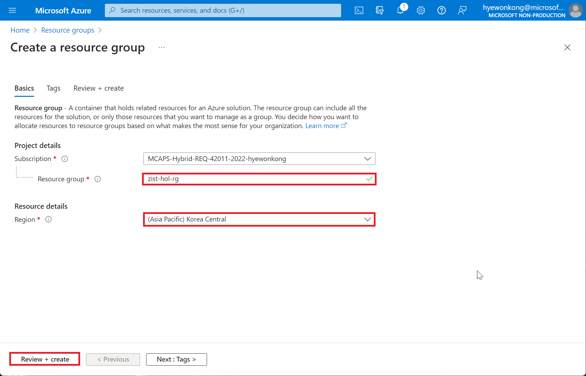


#### 3-2 VNET 설정

Virtual Network 서비스로 이동해서 생성 버튼 클릭

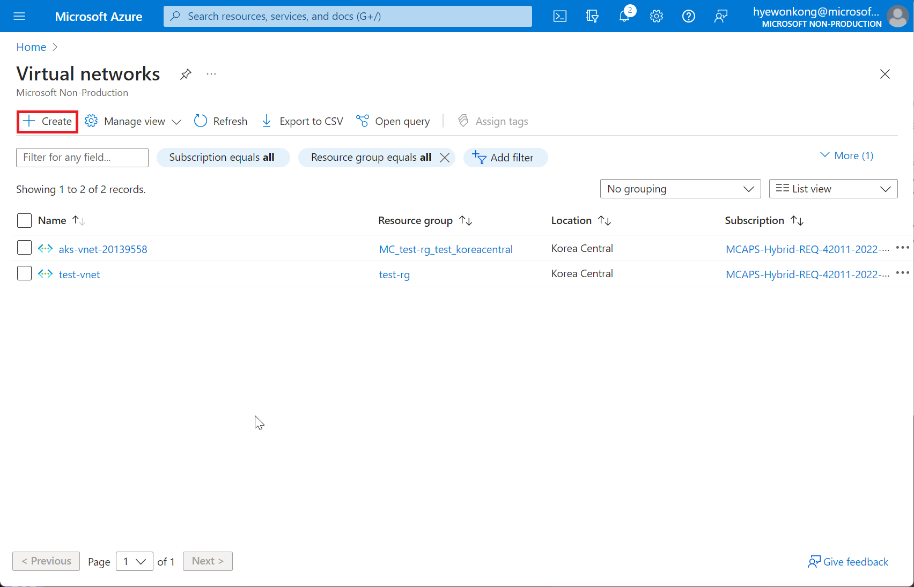


3-1에서 생성한 리소스 그룹 선택 후 VNET이름 지정. 리전은 Korea Central 선택 후 [Review+create]

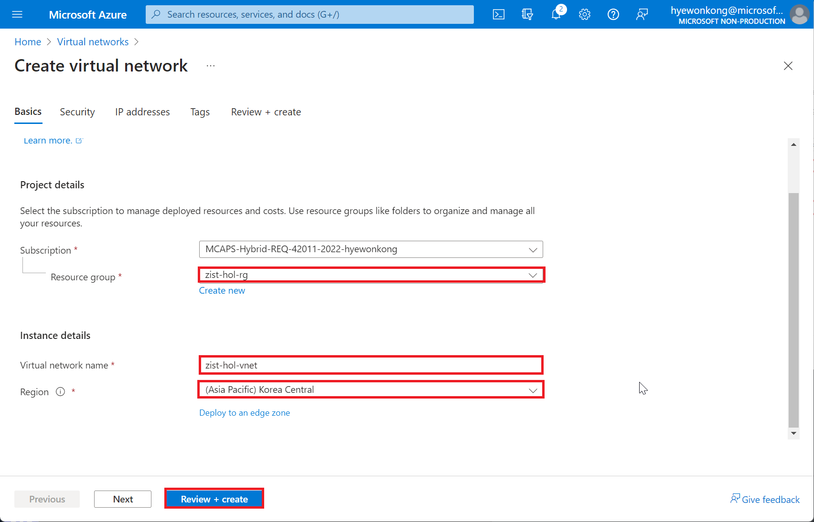


#### 3-3VM 설정

Virtual Machine 서비스로 이동해서 생성 버튼 선택 후 `Azure virtual machine` 선택

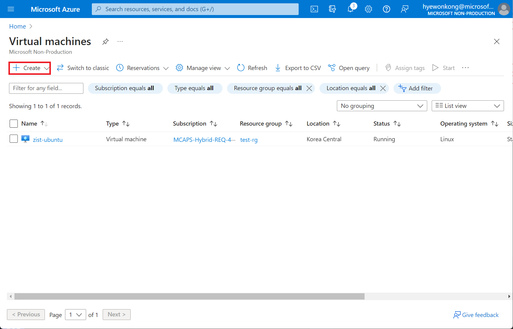


입력값 지정 후 [Review+create]

- Resource group : 생성한 리소스 그룹 선택
- Virtual machine name : VM 이름 입력
- Region : (Asia Pacific)Korea Central
- Security type : Standard

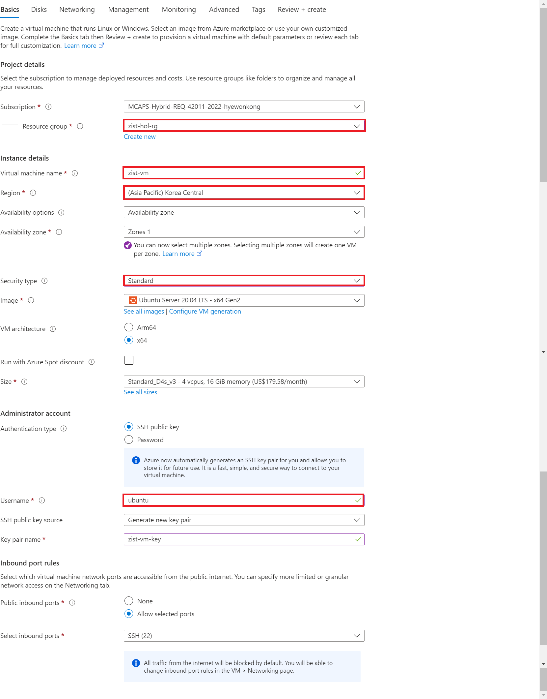


SSH key 다운로드

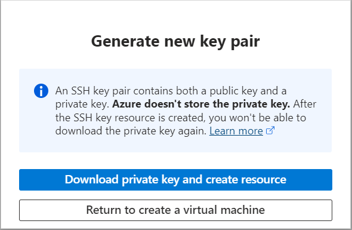


#### 3-4 VM 접속

생성된 VM의 Public IP를 복사 해놓는다.

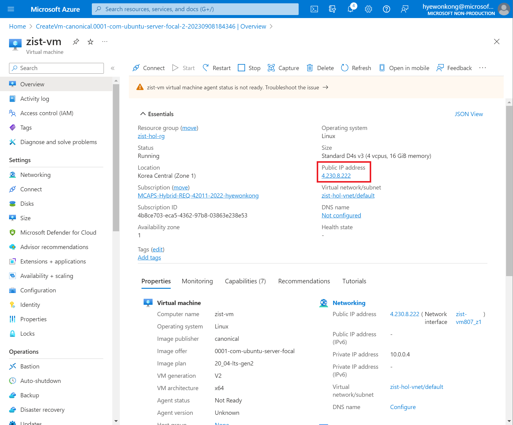


``` bash
# SSH key 파일이 있는 경로로 이동
cd [ssh key 파일 있는 경로]

# VM SSH 접속
ssh -i ./[SSH key 파일] ubuntu@[VM PublicIP]
ex) ssh -i ./kkfe-testkey.pem ubuntu@20.239.49.3
```


#### 3-5 VM세팅

``` bash
# 패키지 정보 업데이트
sudo apt-get update

# 패키지 의존성 검사 및 업그레이드
sudo apt-get dist-upgrade

# python3 패키지 매니저(pip3) 설치
sudo apt-get install python3-pip

# django 설치
pip3 install django
```


### 4)GitHub 설정 

#### 4-1 소스코드 Git에 업로드

로컬 환경에서 manage.py가 있는 경로로 이동 후 아래 명령어 실행

```bash
# git 초기화
git init

# 현재 경로의 모든 파일 추가
git add .

# repository 주소 추가
git remote add origin [레포지토리 주소]

# commit
git commit -m 'first commit'

# push
git push origin master
```

#### 4-2 VM에서 소스코드를 Git 으로부터 받아오기

VM에 SSH 접속 후 아래 명령어 실행

```bash
# srv 폴더가 있는 루트 경로로 이동
cd /

# 소스를 담을 srv 폴더의 소유권을 'azureuser'로 변경
sudo chown -R ubuntu:ubuntu /srv/ 

# srv 폴더로 이동
cd /srv

# Git 복사
git clone [레포지토리 주소]
```

#### 4-3 VM세팅

```bash
# python 가상환경 설치
sudo apt-get install python3-venv

# 가상 환경 설치
cd ~ 
python3 -m venv myvenv

# 가상 환경 활성화
source myvenv/bin/activate

# requirements.txt 파일을 통해 패미지 설치
cd /srv/zist-hol/
pip3 install -r requirements.txt

# Django 서버 시작
python3 manage.py runserver 0:8080
```

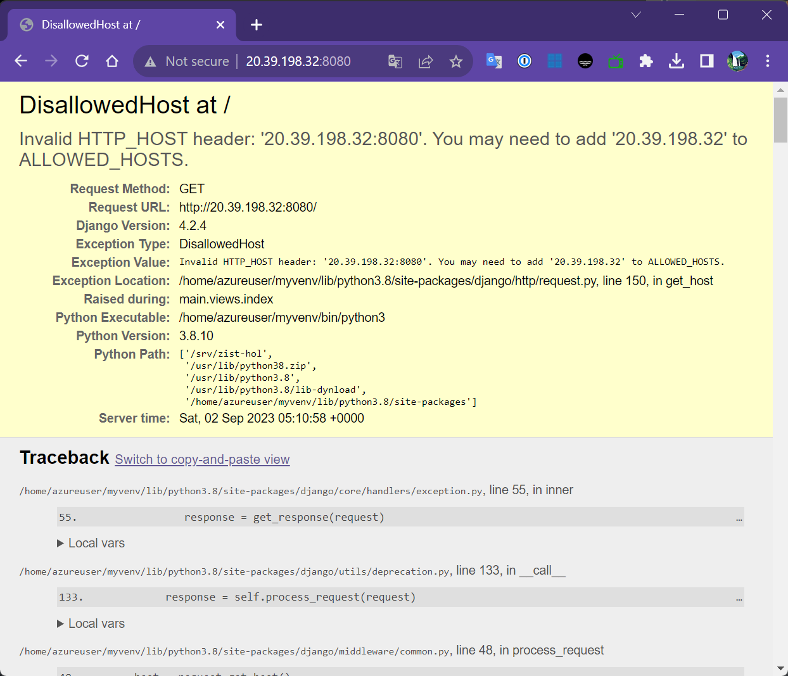

위와 같은 화면이 뜨는 경우, ALLOWED_HOSTS에 VM의 Public IP를 추가해줘야 한다. 
로컬 개발 환경의 프로젝트에서 settings.py의 ALLOWED_HOSTS에 VM의 PublicIP를 추가해주고 git repository에 업데이트 한다.

```bash
ALLOWED_HOSTS=[
	"VM의 Public IP"
]
```

```bash
git add settings.py
git commit -m 'allowed host update'
git push origin master
```


다시 VM으로 돌아와서,

```bash
# 소스 업데이트
git pull origin master

# 다시 Django 실행
python3 manage.py runserver 0:8080
```

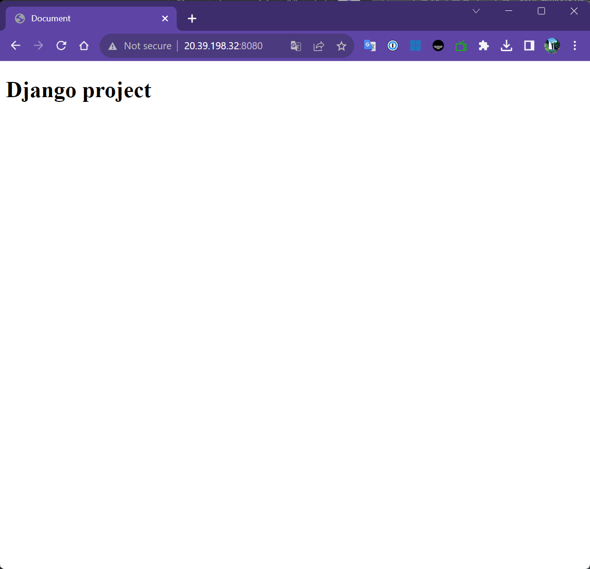


### 5) uwsgi 설정

> wsgi란?(Web Server Gateway Interface)
>
> Python 스크립트가 Web 서버와 통신할 수 있도록 도와주는 역할을 하며 웹 서버와 웹 어플리케이션 중간에 위치 한다. 웹 서버는 html, image 등의 정적인 파일과 소스들을 처리하며 Apache, nginx를 예로 들 수 있다. 웹 어플리케이션은 Django, Flask와 같은게 있고 동적인 요청을 처리하고 웹 서버에게 요청을 처리한 결과를 돌려준다. wsgi는 서버와 앱사이에서 웹 서버가 웹 어플리케이션에게 요청 정보를 전달할 수 있도록 한다. 이를 위해 Callback Object를 사용하며 이는 Function이나 Object의 형태가 될 수 있다. 웹 서버는 Callback Object를 통해 HTTP request에 대한 정보(Method, URL, etc)와 Callback 함수 정보를 전달해 줘야 한다.
>
> 대표적인 wsgi middleware 라이브러리로는 Gunicorn, mod_wsgi, uwsgi 이 있다.
>
> 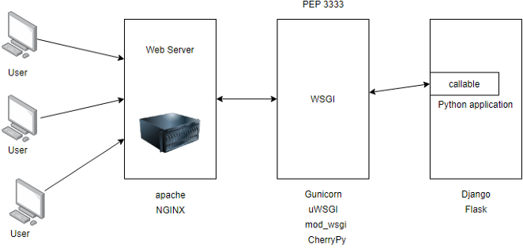

VM에 SSH로 접속한 다음,

```bash
# 가상 환경 실행
source ~/myvenv/bin/activate

# wheel 패키지 설치(uwsgi 설치 시 에러 안나개 하기 위해)
pip3 install wheel

# uwwgi 설치
pip3 install uwsgi

# uwsgi 실행
uwsgi --http :[포트번호] --home [가상환경 경로] --chdir [장고프로젝트폴더 경로] -w [wsgi 모듈이 있는 폴더].wsgi
# ex) uwsgi --http :8080 --home /home/azureuser/myvenv/ --chdir /srv/zist-hol/ -w mysite.wsgi
```


로컬 개발 환경으로 돌아와서,

```bash
# 가상 환경 실행
source myvenv/bin/activate

# manage.py가 있는 폴더로 이동
cd /mysite

# .config 라는 폴더 생성 후 이동
mkdir .config
cd .config

# uwsgi 라는 폴더 생성 후 이동
mkdir uwsgi
cd uwsgi

# mywite.ini 파일 생성
vi mysite.ini
```


mysite.ini 파일
```bash
[uwsgi]
chdir = /srv/zist-hol/ # 장고 프로젝트 경로
module = mysite.wsgi:application # uwsgi 실행 명령어의 -w 옵션과 동일
home = /home/ubuntu/myvenv/ # 가상 환경 경로

uid = ubuntu # uwsgi를 사용할 계정
gid = ubuntu # uwsgi를 사용할 그룹

http = :8080 # 사용할 포트 번호

enable-threads = true
master = true
vacuum = true
pidfile = /tmp/mysite.pid
logto = /var/log/uwsgi/mysite/@(exec://date +%%Y-%%m-%%d).log # uwsgi 서버 로그 저장할 폴더
log-reopen = true
```

추가한 파일을 Git 에 반영한 다음, VM으로 돌아가서

```bash
# 최신 소스 업데이트
git pull

# uwsgi 로그 저장할 폴더 생성
sudo mkdir -p /var/log/uwsgi/mysite

# 로그를 작성할 수 있도록 생성한 폴더의 소유자를 azureuer 로 변경
sudo chown -R ubuntu:ubuntu /var/log/uwsgi/mysite/

# mysite.ini의 옵션을 이용해서 uwsgi 실행
sudo /home/ubuntu/myvenv/bin/uwsgi -i /srv/zist-hol/.config/uwsgi/mysite.ini
```

웹 브라우저에서 서버ip:8080을 입력했을 때 정상적으로 뜨는 것을 확인.


### 6) nginx 설정

VM 환경에서 아래 명령어 실행
```bash
# nignx 설치
sudo apt-get install nginx

# nginx.conf 파일 수정
sudo vi /etc/nginx/nginx.conf
```

```bash
user azureuser; # www-data로 되어있는 user를 azureuser로 변경 
worker_processes auto;
pid /run/nginx.pid;
include /etc/nginx/modules-enabled/*.conf;

events {
        worker_connections 768;
        # multi_accept on;
}

http {

        ##
        # Basic Settings
        ##
```


로컬 개발 환경으로 돌아와서 nginx 설정 파일 생성

``` bash
# 프로젝트 폴더 내에 .config 폴더 생성 후 이동
mkdir .config
cd .config

# .config 폴더 내에 nginx 폴더 생성 후 이동
mkdir nginx
cd nginx

# mysite.conf 파일 생성
vi mysite.conf
```

``` bash
server {
    listen 80; # 요청을 받을 포트 번호
    server_name [서버IP]; # 요청을 받을 서버 주소
    charset utf-8;
    client_max_body_size 128M;

    location / { # 요청이 들어올 경우 처리할 내용에 대해서 정의
        uwsgi_pass  unix:///tmp/mysite.sock;
        include     uwsgi_params;
    }
}
```

사용포트가 80으로 변경 되었으므로 mysite.ini 파일도 수정

``` bash
# 상위 폴더로 이동
cd ../

# 파일 열기
vi ./uwsgi/mysite.ini
```

``` bash
[uwsgi]
chdir = /srv/ubuntu/
module = mysite.wsgi:application
home = /home/ubuntu/myvenv/

uid = ubuntu
gid = ubuntu

socket = /tmp/mysite.sock
chmod-socket = 666
chown-socket = ubuntu:ubuntu

enable-threads = true
master = true
vacuum = true
pidfile = /tmp/mysite.pid
logto = /var/log/uwsgi/mysite/@(exec://date +%%Y-%%m-%%d).log
log-reopen = true
```


nginx와 uwsgi를 백그라운드에서 계속 실행시키도록  서비스 파일 생성

```bash
# .config/uwsgi 폴더 안에 서비스 파일 생성
vi uwsgi/uwsgi.service
```

``` bash
[Unit]
Description=uWSGI service
After=syslog.target

[Service]
ExecStart=/home/ubuntu/myvenv/bin/uwsgi -i /srv/zist-hol/.config/uwsgi/mysite.ini # uwsgi를 관리자 권한으로 실행할때의 명령어

Restart=always
KillSignal=SIGQUIT
Type=notify
StandardError=syslog
NotifyAccess=all

[Install]
WantedBy=multi-user.target
```

생성 및 변경된 파일들을 git에 업데이트한 뒤, VM 환경으로 돌아와서 아래 명령어 실행

``` bash
# 최신 소스 업데이트
git pull origin master

# uwsgi.service 파일을 데몬(백그라운드 실행)에 등록하고 /etc/systemd/system/에 링크를 연결
sudo ln -f /srv/zist-hol/.config/uwsgi/uwsgi.service /etc/systemd/system/uwsgi.servie

# 데몬 새로고침
sudo ststemctl daemon-reload

# uwsgi 서비스 사용 가능하게 전환
sudo systemctl enable uwsgi

# uwsgi 서비스 재실행
sudo systemctl restart uwsgi

# Django 프로잭트 내의 nginx설정 파일을 복사해서 nginx 어플리케이션에 등록
sudo cp -f /src/zist-hol/.config/nginx/mysite.conf /etc/nginx/sites-available/mysite.conf

# sites-available 에 복사된 설정 파일을 sites-enables 폴더 안에도 링크
sudo ln -sf /etc/nginx/sites-available/mysite.conf /etc/nginx/sites-enabled/mysite.conf

# site-enable 폴더 안에 기본 파일을 삭제
sudo rm /etc/nginx/sites-enabled/default

# 데몬 새로고침 후 재실행
sudo systemctl daemon-reload
sudo systemctl restart uwsgi nginx
```

클라우드 포털에서 VM 네트워크 세팅에서 80포트 오픈

Django내에서 static 파일 경로가 앱 별로 나뉘어져 있는 것을 하나의 경로로 취합 해야하므로

로컬 개발 환경에서 `settings.py`파일 제일 하단 `STATIC_URL`밑에 아래 값 추가

`STATIC_ROOT=os.path.join(BASE_DIR, 'static')` 하고 가장 위에 `import os`추가

그리고 아래 명령어 실행하면 각 앱들의 static 파일이 프로젝트 폴더 안에 static 폴더를 생성하고 저장(BASE_DIR가 프로젝트 폴더의 절대 경로 의미)

``` bash
# 각 앱의 static 파일이 저장 될 폴더 생성
mkdir static

# static urls 취합 실행
python3 manage.py collectstatic
```


이제 nginx에 static 파일들의 경로를 알려줘야 함
.config/nginx/mysite.conf 

``` bash
server {
	listen 80;
	server_name [서버IP];
	charset utf-8;
	client_max_body_size 128M;
	
	location / {
		uwsgi_pass unix:///tmp/mysite.sock;
		include uwsgi_params;
	}
	
	location /static/ {
		alias /srv/zist-hol/static/;
	}
}
```

업데이트 된 내용을 git에 업로드 후, VM에서 `git pull` 하고 아래 명령어 실행

``` bash
# mysite.conf를 site-availabled에 복사
sudo cp -f /srv/zist-hol/.config/nginx/mysite.conf /etc/nginx/sites-available/mysite.conf

# site-available의 mysite.conf와 site-enabled를 링크로 연결
sudo ln -sf /etc/nginx/sites-available/mysite.conf /etc/nginx/sites-enabled/mysite.conf

# 데몬 새로고침하고 nginx, uwsgi를 재시작
sudo systemctl daemon-reload
sudo systemctl restart uwsgi nginx
```


### 7) Domain 설정

도메인 레지스트라(ex.가비아, 호스팅케이알 등)에서 도메인을 구매한 뒤, VM IP에 대한 A레코드를 추가
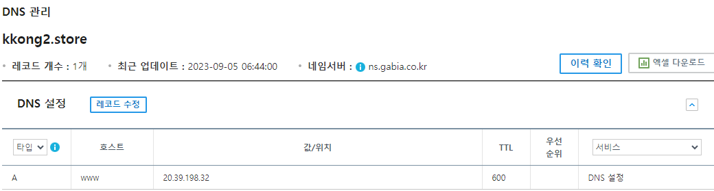

nginx에 바꾼 도메인 설정하기 위해서 로컬 개발 환경에서 소스 수정 후 git 업로드
먼저 settings.py에서

``` bash
ALLOWED_HOSTS = [
	"20.39.198.32",
	".kkong2.store" # 도메인 추가
]
```

그리고 `.config/nginx/mysite.conf`에서 

``` bash
server{
	listen 80;
	server_name 20.39.198.32 *.kkong2.store; # 도메인 추가
	charset utf-8;
	client_max_body_size 128M;
	
	location / {
		uwsgi_pass unix:///tmp/mysite.sock;
		include    uwsgi_params;
	}
	
	location / {
		alias /srv/sizt-hol/static/;
	}
}
```

업데이트된 코드 git에 업로드 후 VM에서 `git pull`한 다음 uwsgi, nginx 서비스 재시작


### 8) HTTPS 적용

> Let's Encrypt 는 인증서 유효 기간이 90일이므로 3개월 마다 한 번씩 인증서를 갱신해야하므로 자동 갱신 설정을 해줘야 한다. 또한 서브 도메인 지원이 안된다.

``` bash
# certbot 설치
sudo apt-get install certbot
sudo apt-get install python3-certbot-nginx

# certbot 실행
sudo certbot --nginx -d www.kkong2.store 

# 인증서 자동 갱신 설정
crontab -e

0 0 1 * * azureuser /usr/bin/certbot renew --renew-hook="sudo systemctl restart uwsgi nginx" # 내용 추가 후 저장
```

